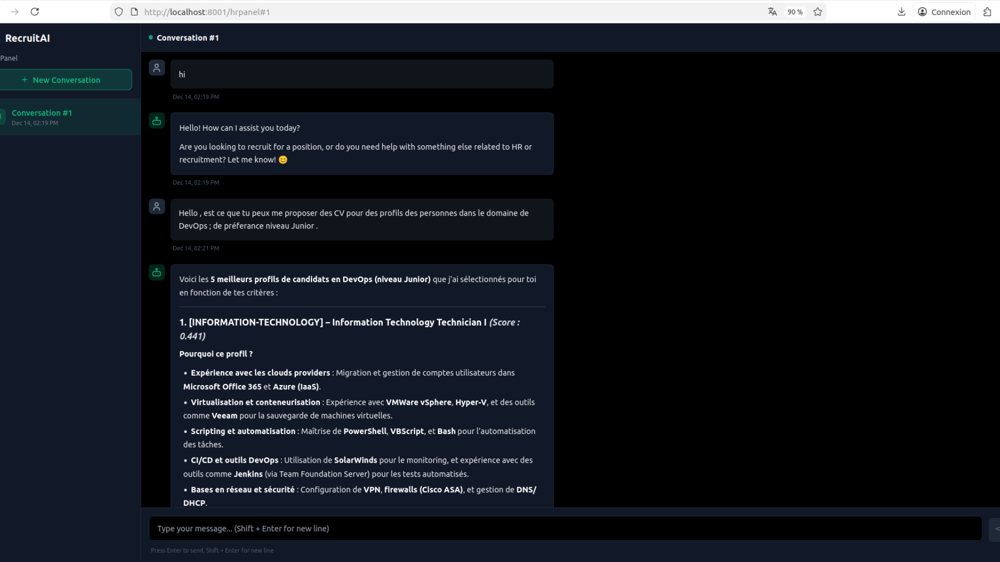
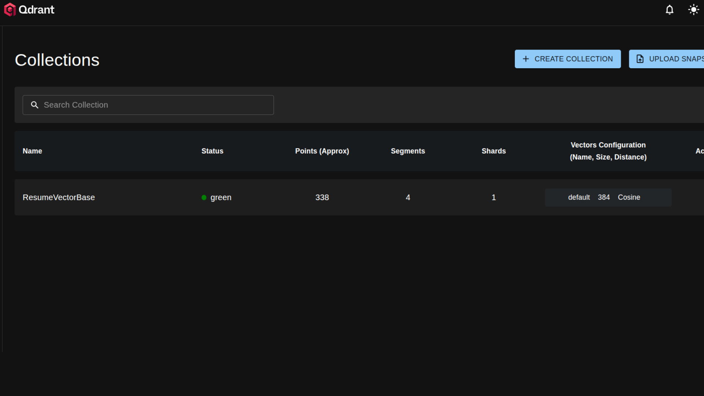
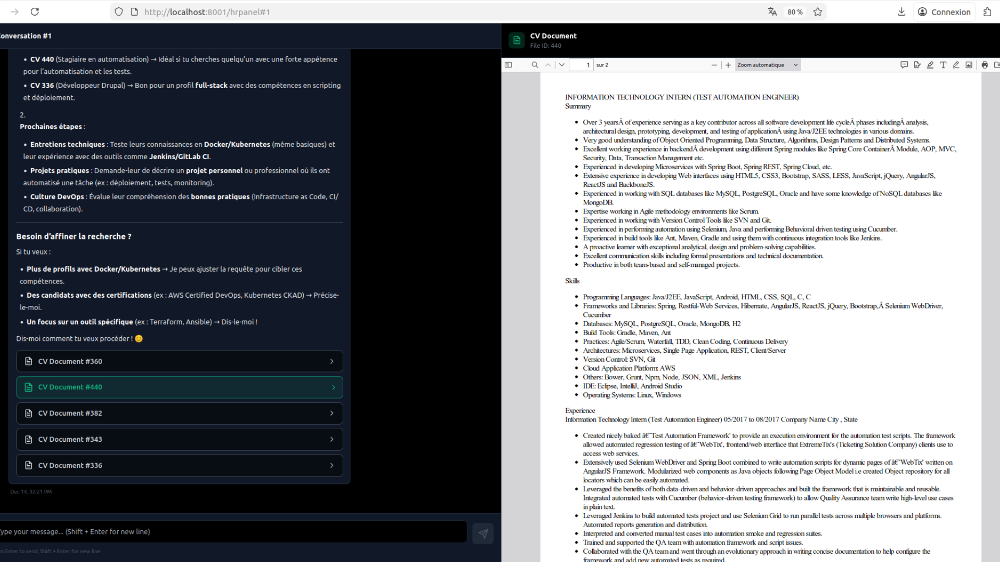
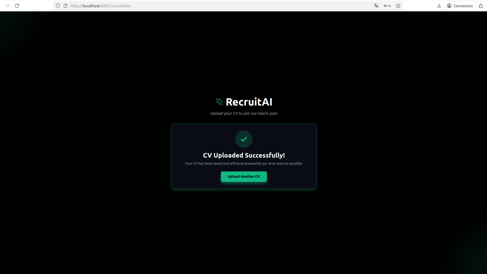

# Assistant RH – Lancement rapide

## 1. Créer le fichier `.env`

Créer un fichier `.env` dans   `src/.env`

```env
MISTRAL_API_KEY=your_mistral_api_key_here

LANGCHAIN_TRACING_V2=true
LANGCHAIN_PROJECT=Assistant_RH
LANGCHAIN_API_KEY=your_langchain_api_key_here

DB_HOST=db
DB_USER=root
DB_PASSWORD=rootpassword
DB_NAME=recruit_AI

DATA_PATH=/app/data
```


---

## 2. Lancer tous les services

```bash
docker compose up --build
```

---

## 3. Accéder aux services

### Backend API (FastAPI)
- http://localhost:8000

### Frontend
- http://localhost:8001

Accès direct aux interfaces :
- **HR Panel (recruteur)** : http://localhost:8001/hrpanel
- **Candidate (dépôt de CV)** : http://localhost:8001/candidate


### Qdrant (base vectorielle)
- Collection : http://localhost:6333/dashboard#/collections

---

## 4. Arrêter les services

```bash
docker compose down -v
```

---

## 5. Application demo

### Interface Chatbot


### Base de Données Qdrant


### Visualisation CV Chatbot


### Upload CV



